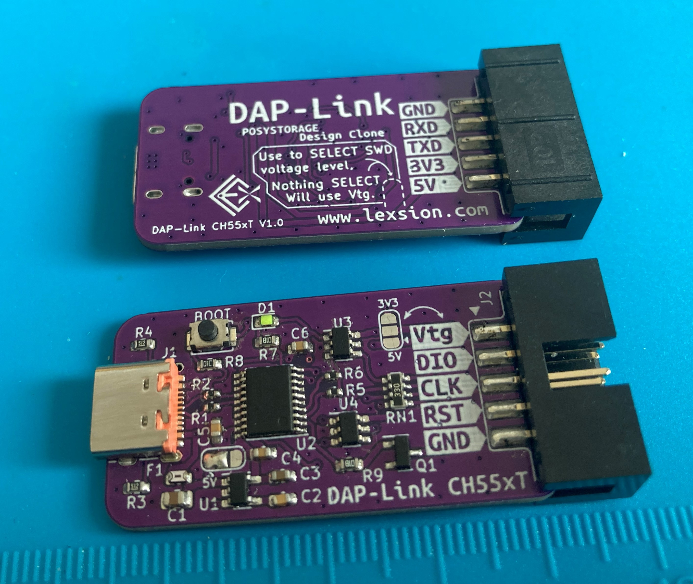
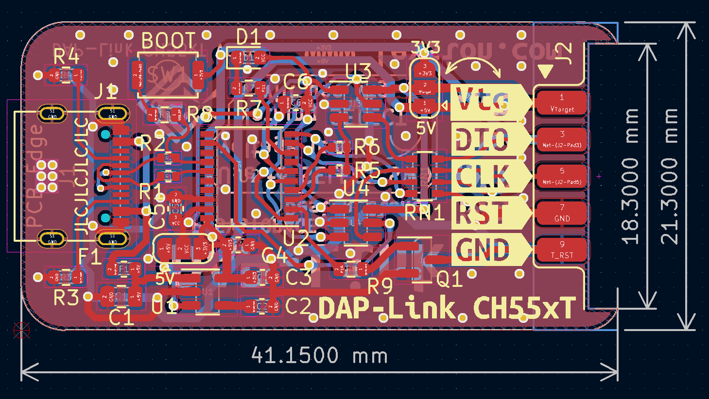
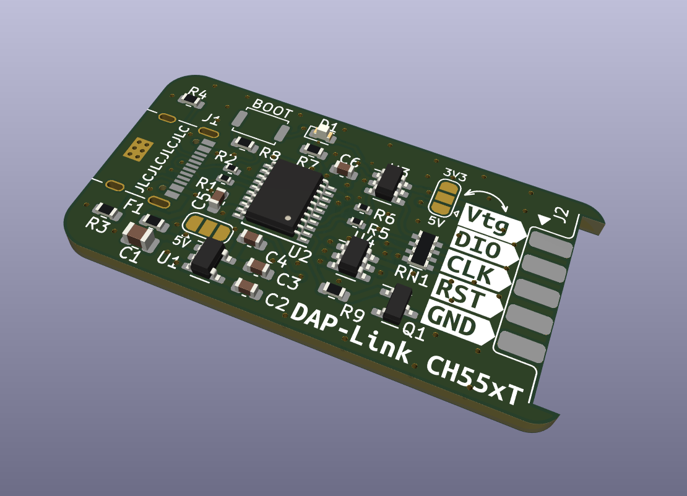
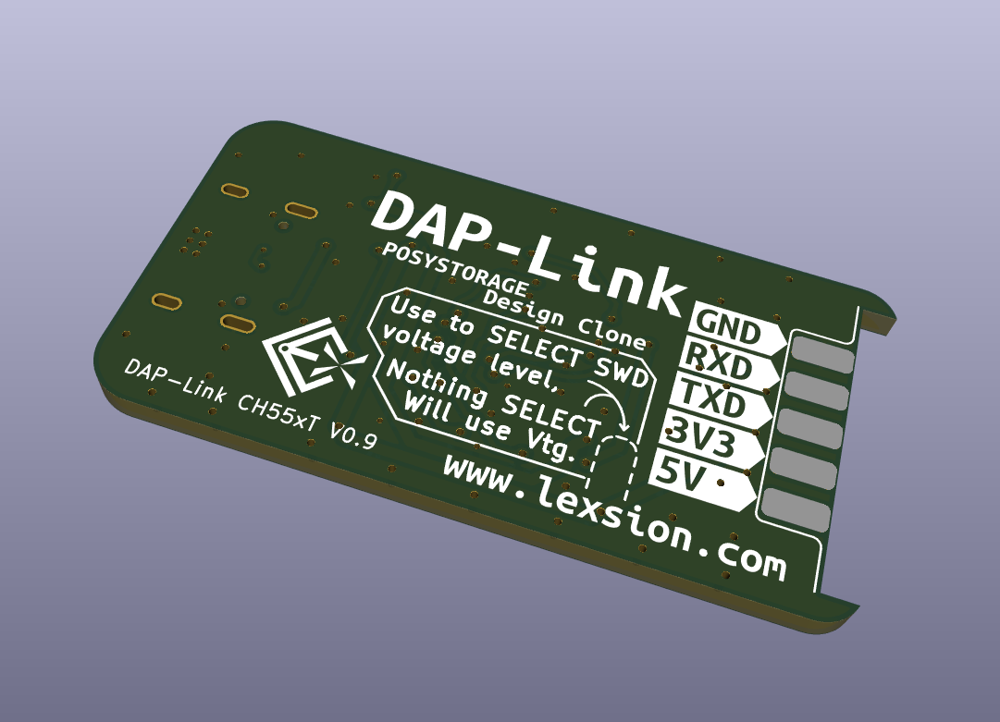

# DAP_Link_CH55xT

此项目是一个 Type-C 接口的 DAP-Link。采用的CH554T方案，抄袭大佬[POSYSTORAGE的开源作品](https://github.com/posystorage/CH55x_HS_DAP-Link-v2)而来，原作使用的CH552G。大佬说对固件进行了优化，速度更快。本人手中只有几片CH554T，于是便画了这张板体验一番。

**警告：V0.9 丝印存在错误，正面的SW接口GND和RST针脚丝印标记放反了。正确丝印从上到下依次为Vtg、DIO、CLK、GND、RST ，此问题已在1.0版本中修正。功能测试可用，考虑配件成本，不再打样**

## 实物图：

## 效果图：

### 2D：

### 3D：

## 基本信息：

| 项目名称  | DAP_Link_CH55xT     |
| --------- | ------------------- |
| PCB工艺   | 1.6mm双面玻纤板     |
| PCB数量   | 1                   |
| PCB尺寸   | 约41.15 * 21.3 (mm) |
| KiCad版本 | 6.0.1               |

## 其他事项：

对比大佬开源的版本，我修改了总线收发器的取电为可选状态，可以通过短接上下部分在3.3V与5V电平间选择。如果不选，则需要通过Vtg连接目标系统电源取电。

PCB目前还没有实际验证，PCB没有预留额外编程器接口。

CH55x是通过出厂预置的USB Bootloader下载固件的，注意少了时不要损坏Bootloader，不要更改下载配置脚。
