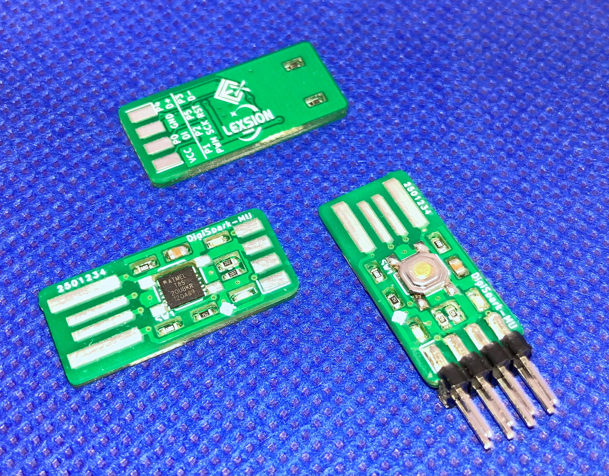
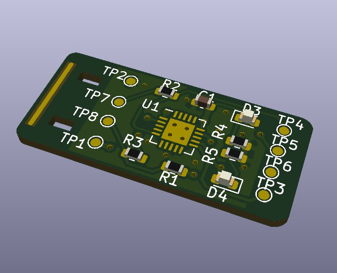
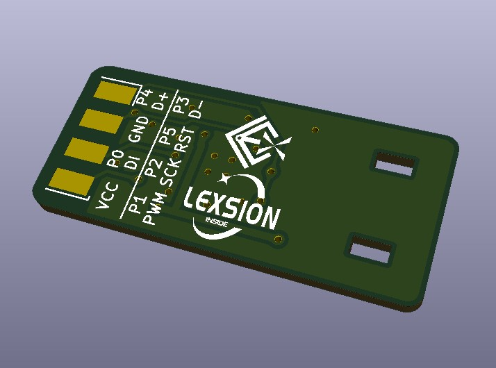
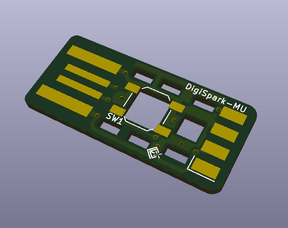
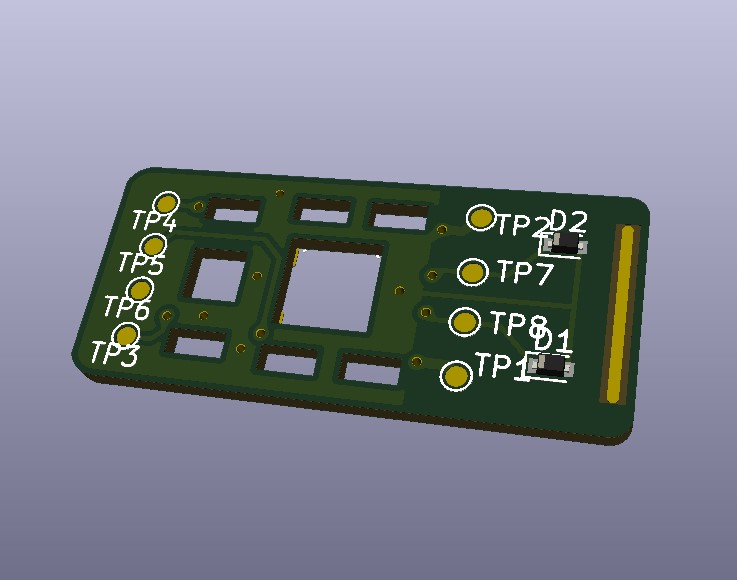

# DigiSpark-MU

此项目仿制了Digistump 的 Digispark，它是一款基于ATtiny85的单片机开发板，类似于Arduino，但它更便宜、更小巧，性能也相对弱一些。通过为其编程，可模拟HID设备（如键盘），从而欺骗电脑使其认为是人在操作它，这类应用称为BadUSB。具体相关内容可以通过网络查询，此处不再赘述。

此项目命名为DigiSpark-MU，是因为对比原始项目，本项目单片机选用了QFN封装的ATtiny85-20MU而不是SOIC封装的SU。因为全球IC价格上涨的关系，SOIC封装的tiny85价格相对更高。而使用QFN封装的IC，不但价格更低，且得益于其不到1毫米的封装厚度，有望实现将芯片隐藏于层叠的PCB中。这样便可以得到比原始设计更小、更薄的设计。为了实现薄化设计，此项目舍弃了为其他电压应用准备的5V LDO，舍弃了USB取电处的防逆流二极管。

> 我才不会说是因为白嫖了立创海外代购51减50活动，Digi-Key的单片机真香。

## 效果图：

### 实物图：

### M板：

### U板（上板）：

## 基本信息：

| 项目名称  | DigiSpark-MU            |
| --------- | ----------------------- |
| PCB工艺   | 双面玻纤板              |
| PCB数量   | 2                       |
| PCB尺寸   | 约26.8 * 12 (mm)  *2PCS |
| KiCad版本 | 5.1.9                   |

## 其他事项：

PCB厚度是1.0mm。

该项目由两片PCB组成。元器件主要集中在下板上，我称其为M板；USB接触的金手、齐纳二极管指和复位按键在上板，称其为U板。项目文件有三个，ALL是所有元器件在一个原理图中，为了提供统一的原理图；M是底层PCB的设计；U是上层板的设计。Gerber文件压缩存放于对应PCB目录的Gerber目录下。

装配方式为两枚PCB分别回流焊，然后再将两枚PCB通过回流焊叠焊在一起。

其他未尽事项请参阅原始文件。