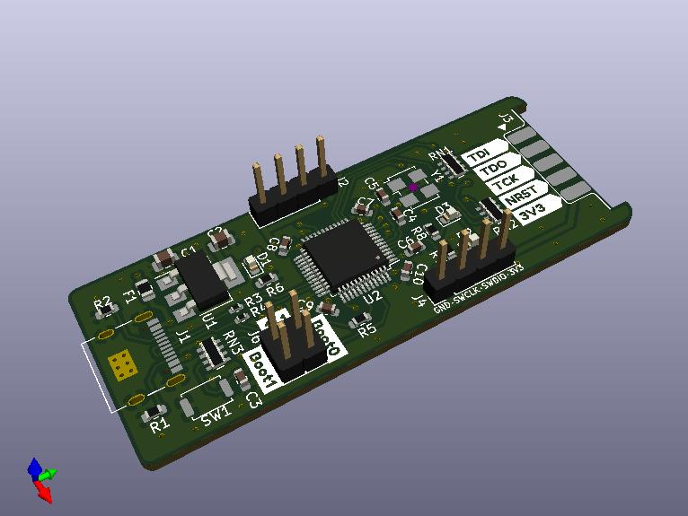
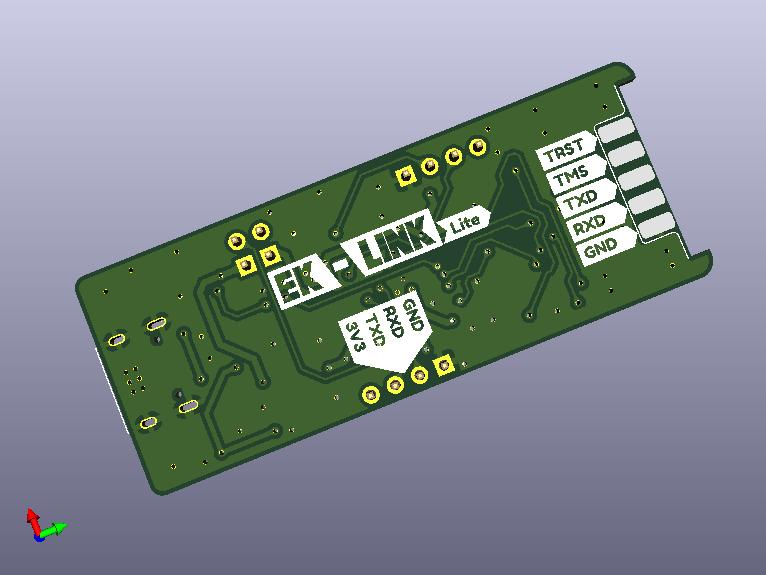
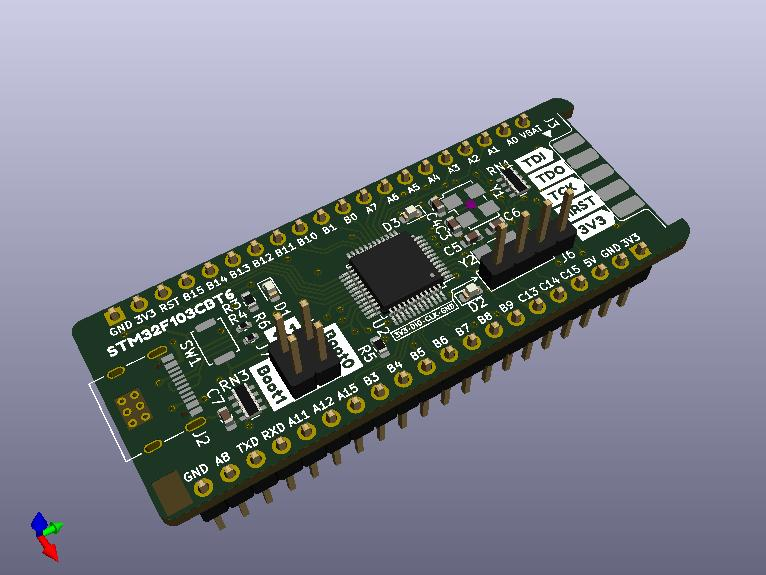
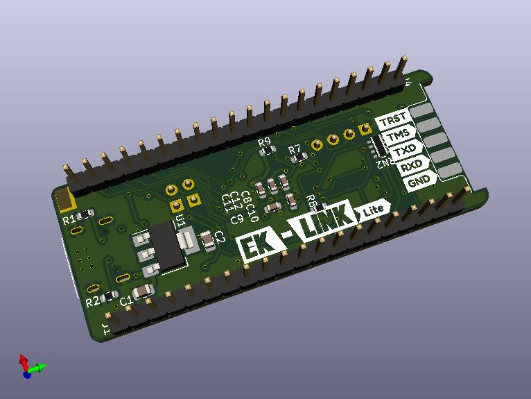

# EK-Link Lite

此项目的目标是做一个引出部分IO到尾部，以实现制作一个某Link调试器的效果。灵感来源于网友们使用STM32最小系统板通过杜邦线连接某MCU进行调试，所以闲暇之余画了两张板。注意，EK-Link Lite是普通的双面板，而引出其他IO的Dev开发板是四层板。

该项目MCU采用的STM32F103CBT6，偶然翻出几年前留下的几枚MCU也是画这板子的原因之一。该板设计了RST按键，并引出了BOOT0、BOOT1以及SWD调试接口，同时为了迎合时代发展，USB采用了Type C接口。

## 效果图：

### EK-Link Lite

### EK-Link Lite Dev

## 基本信息：

### EK-Link Lite:

| 项目名称  | EK-Link Lite   |
| --------- | -------------- |
| PCB工艺   | 双面玻纤板     |
| PCB数量   | 1              |
| PCB尺寸   | 约59 * 23 (mm) |
| KiCad版本 | 5.1.9          |

### EK-Link Lite Dev:
| 项目名称  | EK-Link Lite Dev   |
| --------- | -------------- |
| PCB工艺   | 四层玻纤板 |
| PCB数量   | 1              |
| PCB尺寸   | 约59 * 23 (mm) |
| KiCad版本 | 5.1.9          |

## 其他事项：

暂无。