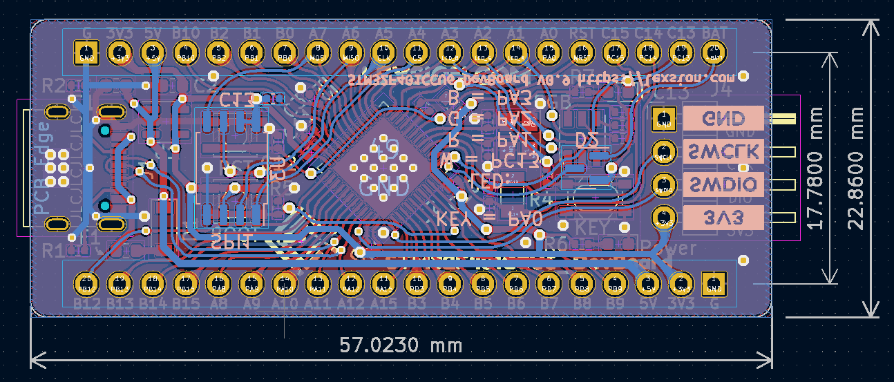
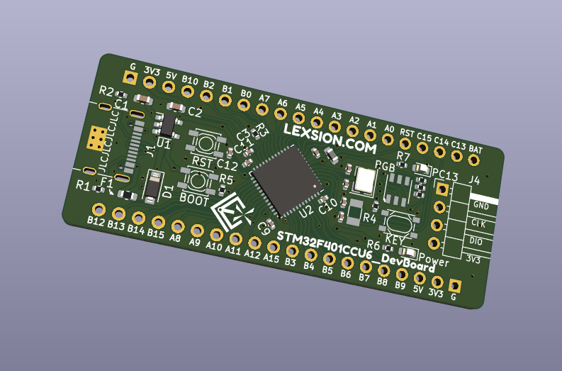
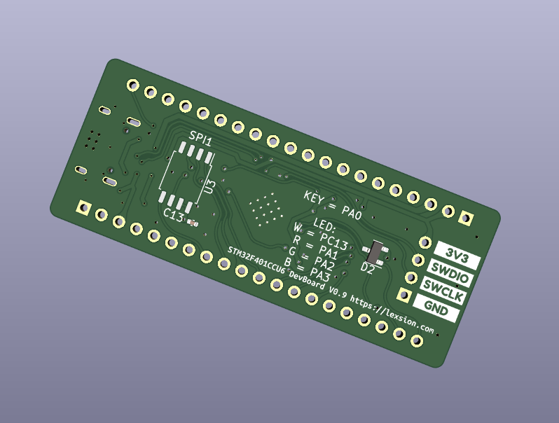

# F401CCU6_Dev

此项目的目标是做一个引出所有IO，以实现一个F401CCU6开发板的效果。参考了网上常见的板型，加入了RGB灯。

该项目MCU采用的STM32F1401CCU6，偶然翻出几年前留下的几枚mPOS也是画这板子的原因之一。该板设计了RST、BOOT按键，并引出了SWD调试接口，同时为了迎合时代发展，USB采用了Type C接口。

## 效果图：

**实物图：**

**2D：**

**3D：**

## 基本信息：

| 项目名称  | F401CCU6_Dev   |
| --------- | -------------- |
| PCB工艺   | 双面玻纤板     |
| PCB数量   | 1              |
| PCB尺寸   | 约57 * 23 (mm) |
| KiCad版本 | 6.0.4          |

## 其他事项：

暂无。