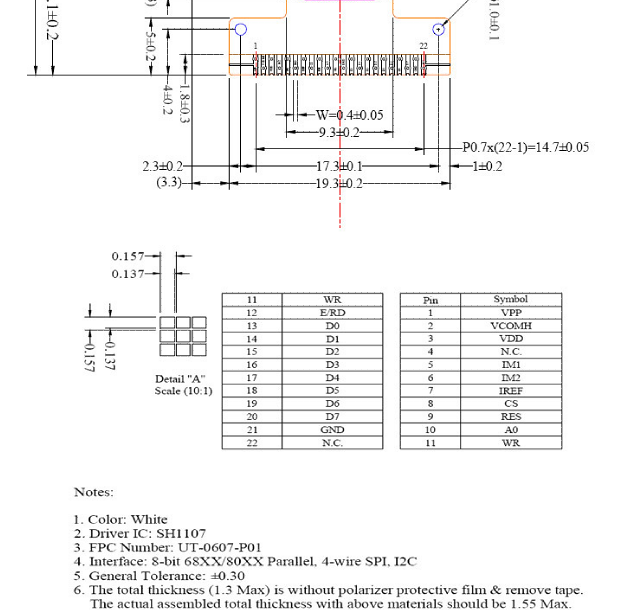
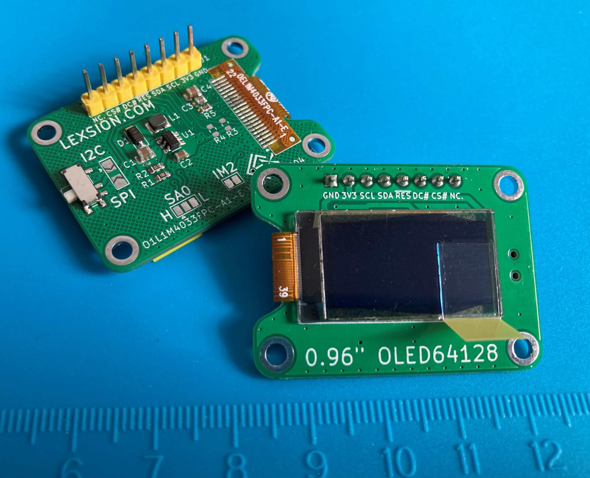
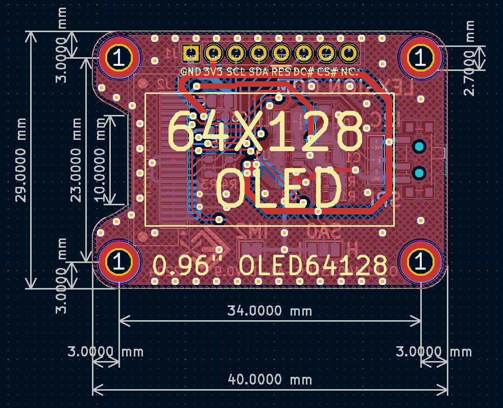
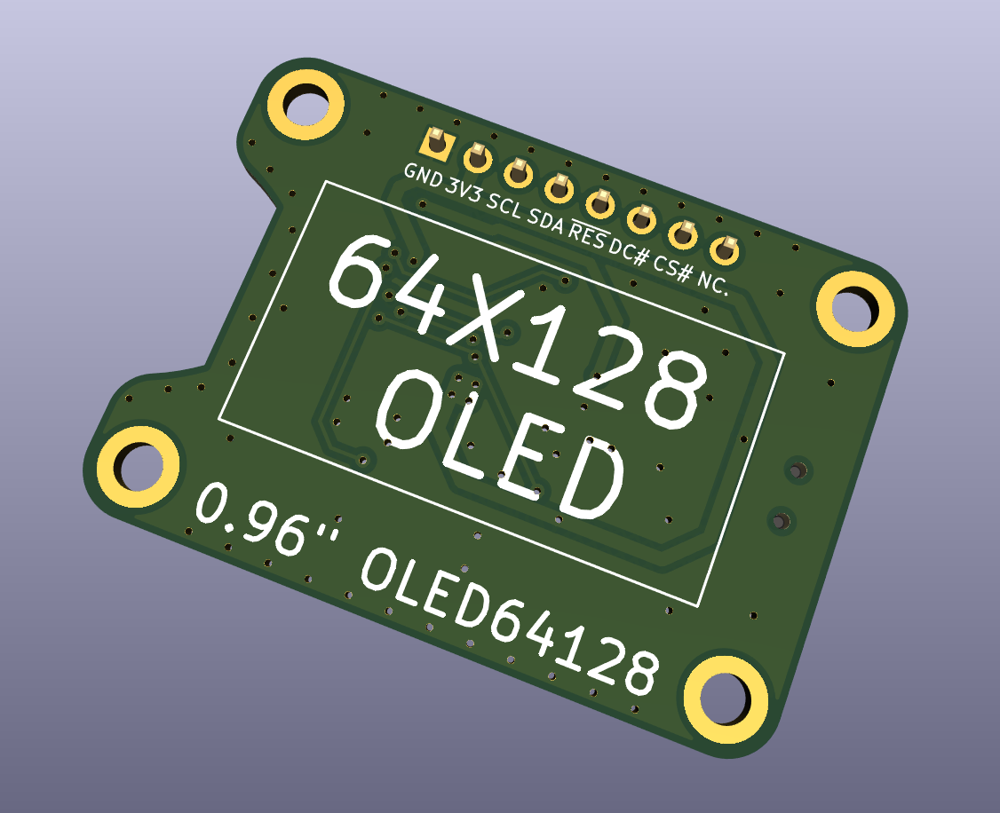
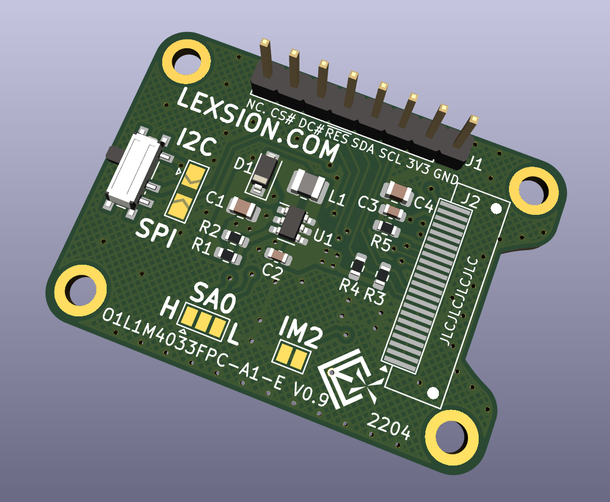

# OLED64128Module_OEL1M4033FPC-A1-E

此项目是一个64128OLED模块。采用的竖向OLED，FPC丝印为OEL1M4033FPC-A1-E，22Pin 0.7mm间距FPC直接焊接，控制器为SH1107。屏幕隔壁老王处购得，据说坏屏占比达70%，大翻车。屏幕对外的8Pin接口，采用的是业界常用的开发板屏幕接口线序，只用到了其中七个针脚。

万能的群友提供了几个22Pin接口的定义图，最终确定屏幕的22Pin接口定义如下：

## 效果图：

### 实物图：

### 2D：

### 3D：

## 基本信息：

| 项目名称  | OLED64128Module_OEL1M4033FPC-A1-E |
| --------- | --------------------------------- |
| PCB工艺   | 1.2mm双面玻纤板                   |
| PCB数量   | 1                                 |
| PCB尺寸   | 约40 * 29 (mm)                    |
| KiCad版本 | 6.0.1                             |

## TODO：

1. - [ ] I2C与SPI选择跳线添加电阻，以防错误配置导致短路？

## 其他事项：

装配时需要使用双面胶将屏幕贴在顶层，然后将排线折至底层焊接，焊接方式建议可使用烙铁拖焊。

驱动代码可在网上搜索解决。OLED驱动IC型号为SH1107，有些知名开发板公司已经提供了常见平台的Demo。拨动开关与旁边的跳点功能一致，使用时二选一，用途是切换4线SPI模式和I2C模式。**注意：跳线点只能选择短接一端，若同时短接会导致3V3对GND短路！**

选择SPI模式时I2C的两个上拉电阻可以不焊。OLED的IM0没有引出，无法设置为3线SPI。

其他可参考SH1107文档。
