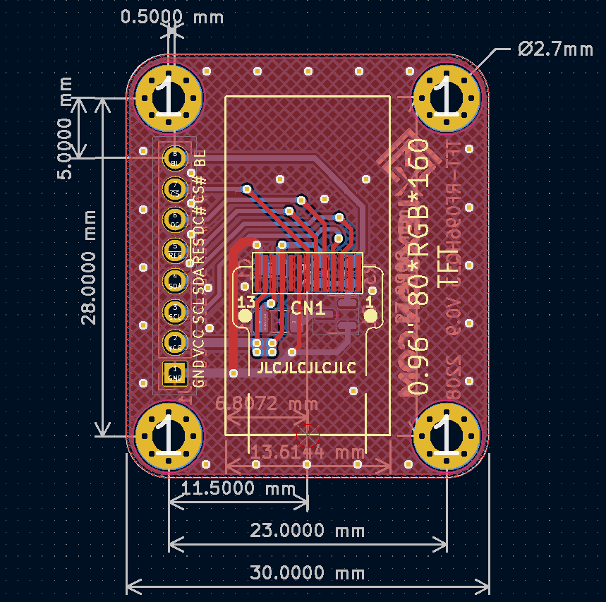
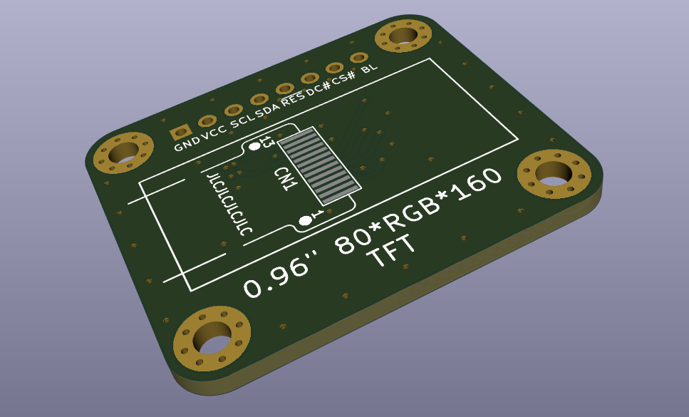
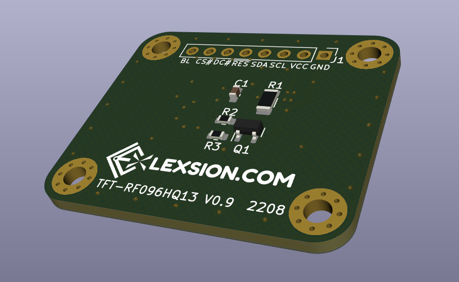

# TFT80160_ST7735_RF096HQ13

此项目是一个 80\*RGB\*160 的 TFT 模块。采用的SPI接口竖向TFT，据说多种款式，FPC丝印大概是96HQ13，13Pin 0.7mm间距FPC直接焊接，猜测控制器为ST7735S。屏幕隔壁老王处购得，本人还未到货，据说碎屏率较高，翻车。屏幕对外的8Pin接口，采用的是业界常用的开发板屏幕接口线序。

尺寸为0.96" 的13Pin SPI TFT 很常见，看大家都是同样的脚位。

注意：此项目暂未实际测试。

## 效果图：

### 2D：

### 3D：

## 基本信息：

| 项目名称  | TFT80160_ST7735_RF096HQ13 |
| --------- | ------------------------- |
| PCB工艺   | 1.2mm双面玻纤板           |
| PCB数量   | 1                         |
| PCB尺寸   | 约35 * 30 (mm)            |
| KiCad版本 | 6.0.1                     |

## 其他事项：

装配时需要使用双面胶将屏幕贴在顶层，然后将排线折至底层焊接，焊接方式建议可使用烙铁拖焊。

ST7735驱动代码可在网上搜索解决。有些知名开发板公司已经提供了常见平台的Demo.

其他可参考ST7735S的文档。
