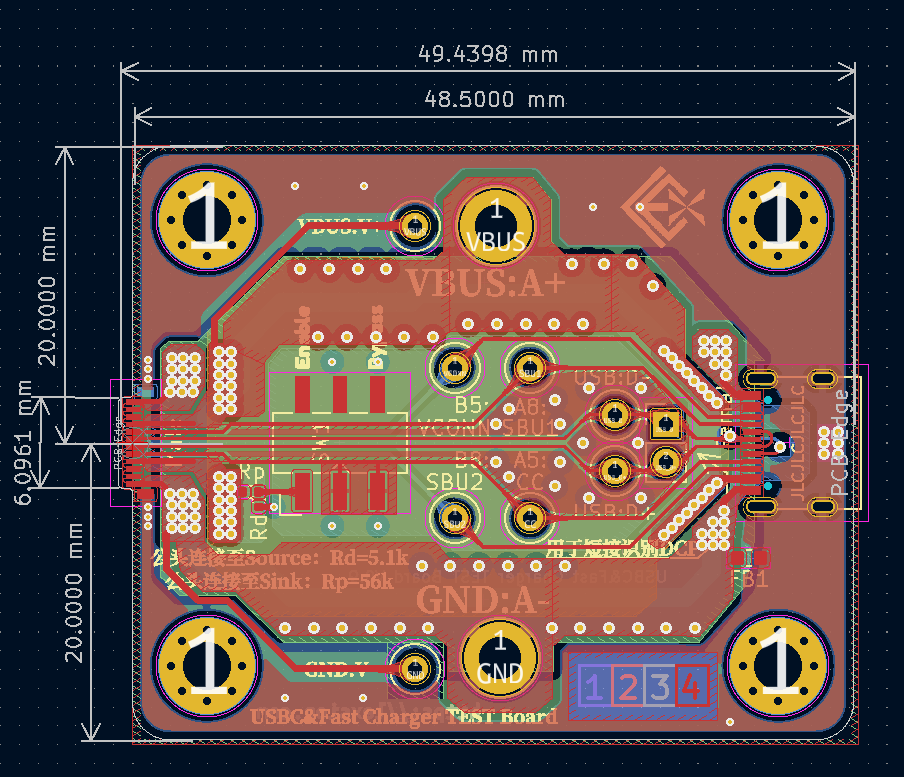
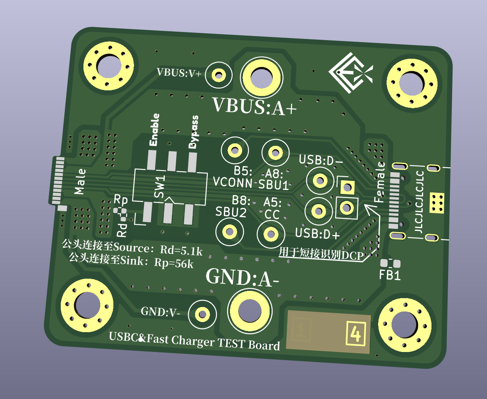
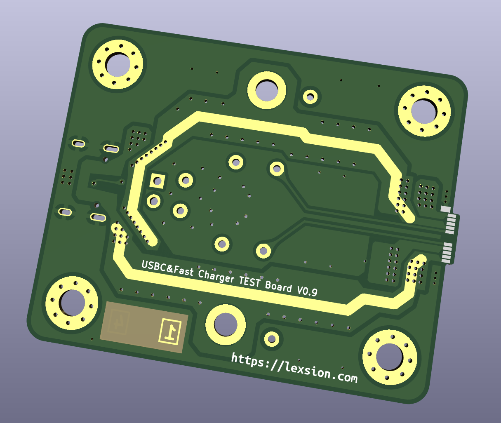

# USBC_PD_TEST

此项目是一个用于USBC口下快速充电协议分析测试的转接板，采用四层板结构，确保能通过大电流。电源部分宽走线与接线柱设计，应该能轻易通过5A电流，测试环便于挂接逻辑分析仪。笔者主要用于学习PD规范过程中的实验验证，限于笔者才疏学浅，该测试板可能会有BUG，有问题欢迎反馈。

**注意：此项目暂未实际测试。**

## 效果图：

### 2D：

### 3D：

## 基本信息：

| 项目名称  | USBC_PD_TEST     |
| --------- | ---------------- |
| PCB工艺   | 0.8mm四层玻纤板  |
| PCB数量   | 1                |
| PCB尺寸   | 约49.5 * 40 (mm) |
| KiCad版本 | 6.0.4            |

## 其他事项：

该板要安装Type-C公头，板厚必须为0.8mm!
